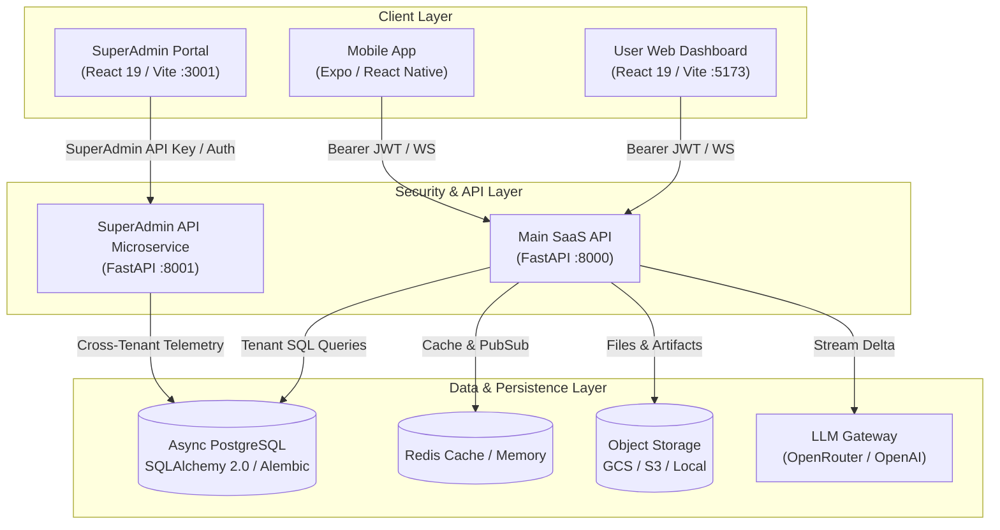

# Multi-Tenant SaaS & AI Agent Application Skeleton

Build production-ready, multi-tenant AI SaaS applications without rebuilding authentication, organizations, RBAC, agent streaming, storage and cloud deployment.

Clone the repository, describe your product to a coding agent, and extend an architecture designed to remain consistent as the application grows.

[Quick Start](#-five-minute-quick-start) · [Architecture](#-architecture-diagram--system-topology) · [Coding Agent Guide](AGENTS.md) · [Local Setup](docs/local_setup.md) · [GCP Deployment](docs/gcp_deployment.md) · [AWS Deployment](docs/aws_deployment.md)

---

[](https://github.com/samimasod)
[]()
[](LICENSE)
[](https://www.python.org/)
[](https://fastapi.tiangolo.com/)
[](https://react.dev/)
[](https://www.typescriptlang.org/)

---

## 📸 Product Preview

| Component | Description | Preview |
| :--- | :--- | :--- |
| **User SaaS Dashboard** | Multi-tenant web dashboard with real-time agent interaction & workspace switcher. | `[User Web App: http://localhost:5173]` |
| **Agent Chat & Tools** | Stateful WebSocket streaming with inline visual tool cards (Weather, Stocks, Mortgage). | `[Agent Chat View: <AgentChatView />]` |
| **Human-in-the-Loop** | Mutation approval card gating database writes and external API actions. | `[ToolApprovalCard Component]` |
| **SuperAdmin Portal** | Isolated operations control plane for cloud metrics, token telemetry, & tenant limits. | `[SuperAdmin Dashboard: http://localhost:3001]` |
| **Mobile App Shell** | Expo / React Native client supporting mobile agent workflows. | `[Mobile Client App]` |

---

## 🎯 Why This Project Exists

Most SaaS starters provide basic authentication and a landing page, forcing engineering teams to spend months re-building:
- Strict **multi-tenant database boundary isolation** and organization role permissions.
- Stateful **WebSocket streaming loops** for real-time AI Agent orchestration.
- Interactive **Generative UI tool cards** and Human-in-the-Loop tool approval gates.
- A decoupled **SuperAdmin operations control plane** to monitor database pool health and tenant token usage.

This repository provides an **agent-ready, production-grade foundation** where all boilerplate, security boundaries, telemetry pipelines, and type-generation tooling are already built and tested.

---

## 🎯 Who It Is For—And Who It Is Not For

### ✅ Good Fit
- **B2B Multi-Tenant SaaS Products**: Platforms requiring tenant organizations, seat roles (`Owner`, `Admin`, `Member`, `Viewer`), and quota controls.
- **AI-Native Products & Copilots**: Applications embedding agentic LLM workflows, sandboxed tools, and real-time streaming.
- **Developers Building with Coding Agents**: Teams using Antigravity, Cursor, or Claude Code who want pre-encoded architectural rules ([AGENTS.md](AGENTS.md)) to guide code generation without architectural decay.

### ❌ Not Currently Intended For
- **Simple Single-Page Landing Pages**: If you only need a static brochure or blog, this monorepo may add unnecessary complexity.
- **Consumer Mobile-Only Apps**: The mobile client is a companion app; the primary client features are web-focused.
- **Kubernetes Enterprise Deployments**: Requires adaptation for complex k8s orchestration (out-of-the-box templates support Docker, Cloud Run, and ECS Fargate).
- **Regulated Environments without Independent Security Audit**: Always perform an independent security review before deploying to compliance-regulated production environments (HIPAA/PCI-DSS).

---

## ⚡ Five-Minute Quick Start

### 1. Prerequisites
- **Node.js**: `v18.0.0` or higher
- **pnpm**: `v8.0.0` or higher (`npm i -g pnpm`)
- **Python**: `v3.11` or higher
- **Docker** *(optional, for containerized database/redis)*

### 2. Quickstart Commands

```bash
# 1. Clone the repository
git clone https://github.com/your-org/skeleton.git
cd skeleton

# 2. Copy environment template
cp .env.example .env

# 3. Install Node.js dependencies
pnpm install

# 4. Set up Python environment & dependencies
python3 -m venv .venv
source .venv/bin/activate
pip install -r requirements.txt

# 5. Apply Alembic DDL database migrations
.venv/bin/python -m alembic -c apps/api/migrations/alembic.ini upgrade head

# 6. Launch all applications concurrently
./start.sh
```

### 3. Application URLs & Default Services

| Application | Address / URL | Tech Stack |
| :--- | :--- | :--- |
| **User SaaS Web Dashboard** | `http://localhost:5173` | React 19, Vite, Tailwind CSS |
| **Main SaaS Backend API** | `http://localhost:8000` | FastAPI, Async SQLAlchemy 2.0 |
| **SuperAdmin Operations Portal** | `http://localhost:3001` (or `3002`) | React 19, Vite, Tailwind CSS |
| **SuperAdmin API Microservice** | `http://localhost:8001` | FastAPI, Async SQLAlchemy 2.0 |
| **Marketing Website** | `http://localhost:3000` | Next.js 15, React 19 |

> **Note on External API Keys**: An external LLM API key (e.g. OpenRouter/OpenAI) is **optional** for local testing. The agent runtime includes built-in mock responses and tool triggers for offline development.

---

## 📊 Feature Status Matrix

| Capability | Status | Implementation Details |
| :--- | :--- | :--- |
| **Tenant Data Isolation** | ✅ Implemented & Tested | `organization_id` FK with `ondelete="CASCADE"` on all domain models |
| **Organization RBAC** | ✅ Implemented & Tested | `check_permission()` enforcing Owner, Admin, Member, Viewer roles |
| **Agent WebSocket Streaming** | ✅ Implemented & Tested | Stateful real-time WebSocket protocol (`/api/agents/{id}/chat/ws`) |
| **Sandboxed Tool System** | ✅ Implemented & Tested | Namespace execution with `inline`, `collapsible`, `both` UI display modes |
| **TOON Token Optimization** | ✅ Implemented & Tested | Tabular JSON TOON serializer saving 30%–60% context tokens |
| **Human-in-the-Loop Approval** | ✅ Implemented & Tested | Tool gate requiring explicit approval (`require_approval=True`) |
| **SuperAdmin Monitoring API** | ✅ Implemented & Tested | Decoupled microservice for cloud pool health & token telemetry |
| **TypeScript Type Generation** | ✅ Implemented & Tested | `pnpm typegen` converting Pydantic V2 schemas to TypeScript interfaces |
| **Mobile Client App** | 🟡 Partial | Expo / React Native shell with agent chat view |
| **Stripe Billing Metering** | 📅 Planned | Usage-based billing integration |
| **IaC Terraform Templates** | 📅 Planned | Automated Terraform scripts for AWS & GCP |

---

## 🤖 Build with a Coding Agent (Headline Feature)

This codebase is specifically engineered to pair with AI coding agents (Antigravity, Cursor, Claude Code). Deep architectural rules are encoded in [AGENTS.md](AGENTS.md) and [GEMINI.md](GEMINI.md).

### Standard 8-Step Module Pattern
Whenever adding a new domain feature, your coding agent follows a strict 8-step structure:

```text
apps/api/modules/<module_name>/
├── __init__.py
├── models.py      # Step 1: SQLAlchemy 2.0 ORM model with organization_id FK
├── schemas.py     # Step 2: Pydantic V2 schemas (Create, Update, Response)
├── repository.py  # Step 3: AsyncSession data access with pagination
├── service.py     # Step 4: Business logic, permission checks, NotFound errors
└── router.py      # Step 5: FastAPI router with PaginationParams & response builder
```
- **Step 6**: Register router in `apps/api/main.py`
- **Step 7**: Register model in `apps/api/migrations/env.py` and run Alembic migration
- **Step 8**: Synchronize TypeScript types via `pnpm typegen`

### Example Prompt for Your Coding Agent:
> *"Read AGENTS.md and implement a tenant-isolated Documents module. Follow the 8-step module pattern, add permission checks, create an Alembic migration, and run pnpm typegen."*

---

## 🏗️ Architecture Diagram & System Topology



### Security Boundary: Why `api_admin` is a Separate Microservice
`apps/api_admin` runs as an isolated service on port `8001` with independent authentication (`verify_admin_auth`). Ordinary tenant user tokens sent to `apps/api` (port 8000) cannot access SuperAdmin telemetry endpoints, enforcing a physical security boundary between tenant SaaS operations and platform management.

---

## 🔒 Security & Tenancy Model

1. **Automatic Tenant Scoping**: Domain models enforce an `organization_id` foreign key referencing `organizations.id` with `ondelete="CASCADE"`. Backend services query strictly within the validated `organization_id`.
2. **Permission Checking**: API endpoints enforce role boundaries (`Owner`, `Admin`, `Member`, `Viewer`) using `check_permission(role, Permission...)`.
3. **Python Tool Execution Clarification**: Python tools execute in a clean Python namespace using `exec()` with arguments passed to `run(**kwargs)`. For untrusted third-party user code in production, execute tools inside isolated Docker container processes with disabled network access.
4. **TOON Token Optimization Methodology**: TOON (Token-Oriented Object Notation) formats tabular JSON arrays into compact header-delimited key-value blocks, eliminating redundant JSON key strings in LLM context windows and saving 30%–60% of prompt tokens.
5. **WebSocket Authentication**: WebSocket connections (`/chat/ws`) require a valid Firebase ID token or auth credential in query parameters before spawning streaming tasks.

---

## 🚀 Deployment Options

We provide Docker containerization and step-by-step cloud deployment guides:

- **Dockerfiles**: `apps/api/Dockerfile` (Main API) and `apps/api_admin/Dockerfile` (SuperAdmin API).
- ☁️ **[GCP Deployment Guide](docs/gcp_deployment.md)**: Deploying to Google Cloud Run, Cloud SQL PostgreSQL, GCS, and Secret Manager.
- 🟧 **[AWS Deployment Guide](docs/aws_deployment.md)**: Deploying to AWS ECS Fargate, RDS PostgreSQL, S3, and ElastiCache Redis.

---

## 📚 Documentation Index

- 📖 **[Local Development & Quickstart Guide](docs/local_setup.md)**
- ☁️ **[Google Cloud Platform (GCP) Deployment Guide](docs/gcp_deployment.md)**
- 🟧 **[Amazon Web Services (AWS) Deployment Guide](docs/aws_deployment.md)**
- 🛠️ **[Developer & CRUD Architecture Guide](docs/developer_guide.md)**
- 🤖 **[AI Agent Creation & Tool Integration Guide](docs/agent_creation_guide.md)**
- 📋 **[Coding Agent Directives (AGENTS.md)](AGENTS.md)**

---

## 🗺️ Roadmap & Contributing

- 🗺️ **[Product Roadmap](ROADMAP.md)**: Check current implementation status and upcoming features.
- 🤝 **[Contributing Guidelines](CONTRIBUTING.md)**: Guidelines for opening issues and submitting pull requests.
- 🔒 **[Security Policy](SECURITY.md)**: Security vulnerability disclosure policy.

---

## 📄 License & Author

- **Author & Maintainer**: **Sami Masod** ([@samimasod](https://github.com/samimasod))
- **License**: Distributed under the **MIT License**. See [LICENSE](LICENSE) for details.
